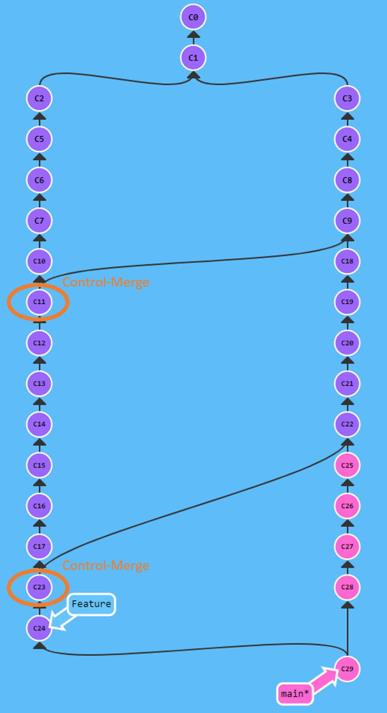

# git upfresh - Conference session preparation

## Topics for the confrence talk

* git stash (possible with link to stashing partially staged changes) (<https://github.blog/2022-01-24-highlights-from-git-2-35/>)
* git sparse checkout (<https://github.blog/2021-11-15-highlights-from-git-2-34/>)
* ort merge algorithm

* replace a single commit (amend) with fixup

```shell
marko@hp-lx:~/projects/git$ git commit --fixup=amend:6e158
[main d320976] amend! Three
marko@hp-lx:~/projects/git$ git rebase -i c30cc --autosquash
Erfolgreich Rebase ausgeführt und refs/heads/main aktualisiert.
```

* git [rerere](https://medium.com/@porteneuve/fix-conflicts-only-once-with-git-rerere-7d116b2cec67)
 (Reuse Recorded Resolutin)
  * Long-running feature branches usually have the characteristic of diverging
  too much from their main branch.
  * Typically, the changes of the main branch are then taken over by control
  merges or rebasing on such feature branches. The control merge, however,
  makes for a messy history due to the merge commits. However, the merge
  commits also contain all merge conflicts that have occurred up to that point
  and therefore only have to be resolved once.

  <p align="center" width="100%">
    
  </p>

  * In order to prevent the history from becoming messy and unclear due to
  control merges, we need another way to record conflicts that have popped up.
  Exactly at this point the rer feature of git comes into play. Rerere is short
  for "Reuse Recorded Resolution" and does exactly what it says.
